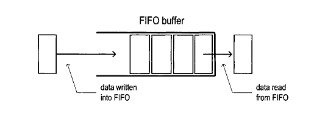
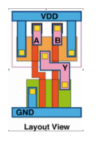
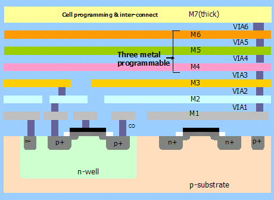
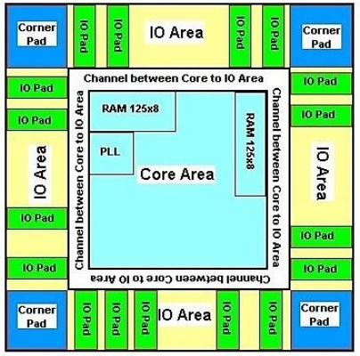
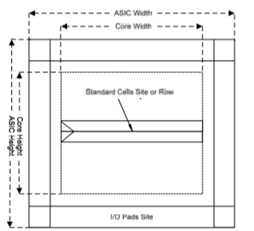
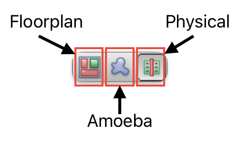
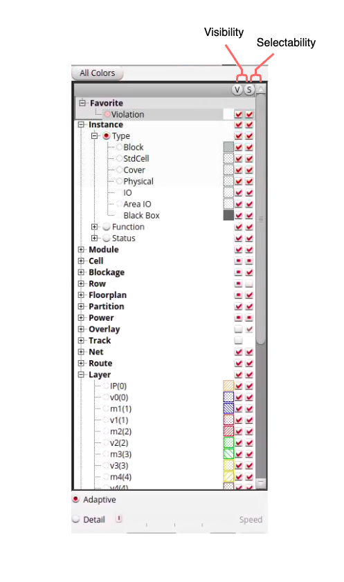
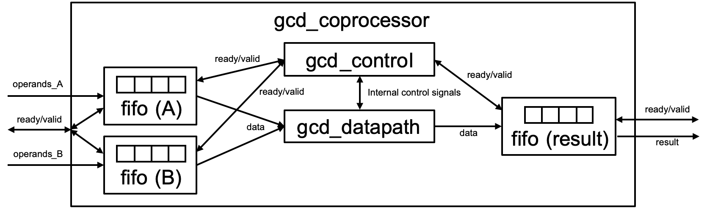


# ASIC Lab 5: Floorplanning, Placement, Power, and CTS
<p align="center">
Prof. Daniel Van Blerkom
</p>
<p align="center">
Department of Electrical and Computer Engineering, Cal Poly Pomona
</p>
(Modified from original UCB EECS 150 lab)


## Overview
**Setup:**
Pull lab5 from the Github Classroom into your home directory:
   ```
   cd 
   git clone ssh://git@ssh.github.com:443/dvb-ece-cpp/lab5-fa24-4203-(your github id).git
   ```

Don't forget to activate the conda environment every time you log in:
```
conda activate ece4203
```

**Objective:** 
In this lab, you will be introduces to place and route. This stage is digital design following synthesis. It takes the netlist, efficiently places cells, and creates routes or connections between cells to implement your design. This lab consists of three parts:
1. For the first part, you will be writing a GCD coprocessor that could be included alongside a general-purpose CPU
2. You will then learn how the tools can create a floorplan, route power straps, place standard cells, perform timing optimizations, and generate a clock tree for your design
3. You will also run place-and-route on the ALU from Lab 4.


**Topics Covered**
- Place and Route 
- Metal Layers
- Standard Cell
- CAD Tools 
- Hammer
- Skywater 130mm PDK
- Reading Reports

**Recommended Reading**
- [Verilog Primer](https://courses.csail.mit.edu/6.111/f2004/handouts/L04.pdf)
- [Hammer-Flow](https://hammer-vlsi.readthedocs.io/en/latest/Hammer-Flow/index.html)
- [Ready-Valid Interface](https://www.eecs151.org/files/verilog/ready_valid_interface.pdf)

# Background

The sections presented here are meant to provide context that will benefit you in the lab exercise. Please review them to gain a better understanding of the what, the why, and the how of physical design for ASICs.


## FIFO

A first-in first-out (FIFO) queue is a common data structure in both hardware and software. The purpose of a FIFO is to buffer, or hold, incoming data until that data requested. Once requested, data will exit the FIFO. There are many implementations of FIFO, but they all follow a single strict ordering rule: *any particular entry must exit the FIFO prior to any entries that entered after it.* For this reason, a FIFO is often compared to a queue, or line formed as entrances (ex. a line to enter a concert or a line formed in school cafeteria for lunch). FIFOs are frequently utilized in digital design at module interfaces. 

<figure align="center">
  
  <figcaption align="center">Block diagram of a FIFO (borrowed from: http://tinyurl.com/2becpjhk).</figcaption>
</figure>


Conceptually, there are two sides to a FIFO: (1) one side receives incoming data and (2) the other side outputs outgoing data. Each "side" is a separate interface, often a simple ready-valid interface. The FIFO *width* describes the bitwidth of the data it contains. The FIFO *depth* describes the number of entries the FIFO can hold. 

It is critical understand that a FIFO is constructed from some form of memory. FIFOs are composed of etiher registers or SRAM. Although functionality is the same regardless of the underlying memory, the cost of implementation in ASIC design is different, especially for wide and/or deep FIFOs. In ASIC design, registers are consider to be more expensive as they are not as compact as SRAM. Therefore, large FIFOs are preferrablly SRAM based. 

## Standard Cell
A standard cell is predefined physical layout of transistors for logic gates and storage elements (latches or flip-flops). Standard cells have the same height, but may differ in width. The number of transistors and size of the transistors used determines the size of the standard cell. Each cell comes with timing and power information used during place and route. A cell library is the collection of standard cells used for a process, and is part of the PDK. Within the same PDK, there will be mutiple cells implementing the same logic gate, but with different sized transistors. A variety of cells  implementing the same logical function with different transistor sizes allows the CAD tool to select which variant to use in order to meet power and timing specifications (larger transistors require more power, but can drive larger currents, the trend is opposite for smaller transistors).

<figure align="center">
  
  <figcaption align="center">Layout of NAND gate standard cell.</figcaption>
</figure>


## VLSI

ASICs are 3D structures like a layer cake. At the bottom, is the substrate which is where the transistors lie. Above the substrate are alternating layers of a *metal layer *and a dieletric. The number of layer is process dependent and determined by the foundry.
Metal layers are an important concept to understand in ASIC design. Transistors are connected through metal layers. Routes must go through the dielectric up to a metal layer, route through a layer or mutiple layers, then back down the the subtrate to connect transistors. Conenctions between metal layers are called ***vias***. In addition, power rails are contained in metal layers. Typically, layers higher up contain global route, and layer closer to the substrate contained local route. Power distribution is on the higher layers, and routes between two logic gates are on hte lower layers.

<figure align="center">
  
  <figcaption align="center">Example metal layer stack up of a toy ASIC. Please ignore the "Three metal programmable" annotation in the figure. (borrowed from: http://tinyurl.com/5bjejjsz)</figcaption>
</figure>


## Place and Route
Place and route actualizes your design or circuit with physical transistors. It is part of "physical design" which is also called PD. Place and route (often written as PAR, P&R, PnR) follows directly after synthesis in digital design (both ASIC and FPGA). The netlist produced during synthesis expresses the entire design at the gate-level with cells from the provided PDK. During PAR, a physical cell instance is created for each cell in the netlist and placed in the chip area. Following placement, routes (or traces) are created to wire the cells together as specified by the netlist.


Intuitively, better placement of the cells implies more efficient routing which means less area and the better timing results. Similarly, the opposite is true; poor placement of cells requires long routes and often fails timing (placement is why synthesis timing reports are not accurate for the final circuit). The output of place and route is a layout.


PAR is the most complex and longest stage in the digital design flow. The details of PAR are beyond the level of this lab, however it is important to know the general strategy of its algorithms. The design is first partitioned into sub-designs which exploits parallelism to reduce runtime. The initial placement is iterated upon until the optimal placement is found meeting the design specifications (power, timing, and area) given user constraints. Each CAD tool has their own place and route algorithms, however they all contain similar stages:


1. *Floorplan*
2. *Clock-Tree-Synthesis*
3. *Placement and Route*

  > Note: THIS SECTION IS A SIMPLE INTRODUCTION TO PLACE AND ROUTE. PLACE AND ROUTE IS THE MOST CRITICAL STAGE IN THE ASIC DESIGN FLOW AND ALL DETAILS CAN NOT BE DISCUSSED WITHIN A SINGLE LAB.


### Floorplanning 
Floorplanning is the process of allocating area for the design, constraining how the area is utilized, and power planning. Floorplanning is often the most important factor for determining a physical circuit’s performance, because intelligent floorplanning can assist the tool in minimizing the delays in the design, especially if the total area is highly constrained.

<figure align="center">
  
  <figcaption align="center">Block diagram of floorplan showing die area(full image), IO ring, and core area (borrowed from: http://tinyurl.com/237euu99).</figcaption>
</figure>

The total area designated for the ASIC is called the ***die area*** as it is the total area for a single die. The die area is further subdivided into the IO ring and the core area. The ***IO ring***, sometimes called the IO area, lies between the border of the die area and core area, and is reserved for IO cells. IO cells contain all circuitry required to support I/O including ESD, receiver, driver and IO pads. The remaining area is termed the ***core area***. This is where your design standard cells and macros are placed. The core area is divided into rows of fixed height. Standard cells are placed within these rows. These rows have ***power stripes*** which power to the standard cells and provide structure to the layout of the design.

<figure align="center">
  
  <figcaption align="center">Die area with example rows shown (borrowed from: http://tinyurl.com/bd76apw2).</figcaption>
</figure>


Floorplan constraints can be “hard” or “soft”. “Hard” constraints generally involve pre-placement of “macros”, which can be anything from memory elements (SRAM arrays, in an upcoming lab) to analog black boxes (like PLLs or LDOs). “Soft” constraints are generally guided placements of hierarchical modules in the design (e.g. the datapath, controller, and FIFOs), towards certain regions of the floorplan. Generally, the PAR tool does a good job of placing hierarchical modules optimally, but sometimes, a little human assistance is necessary to eke out the last bit of performance.

Power planning is another major step in floorplanning. ASICs commonly have ***power straps***, route carrying power from the power rails, of different voltages stretched across the core area. The location and arrangement of the rails can be customized to support the given layout of the circuit. Power planning must be done carefully as it affects the placement of macros and standard cells. Furthermore, individual macros might have power rings, or power rails surrounding them which are independent from other logic or macros.


### Clock Tree Synthesis (CTS): Overview

Clock Tree Synthesis (CTS) is arguably the next most important step in PAR behind floorplanning. Recall that up until this point, we have not talked about the clock that triggers all the sequential logic in our design. This is because the clock signal is assumed to arrive at every sequential element in our design at the same time. The synthesis tool makes this assumption and so does the initial cell placement algorithm. In reality, the sequential elements have to be placed wherever makes the most sense (e.g. to minimize delays between them). As a result, there is a different amount of delay to every element from the top-level clock pin that must be “balanced” to maintain the timing results from synthesis. We shall now explore the steps the PAR tool takes to solve this problem and why it is called Clock Tree Synthesis.


<details>
  <summary>Pre-CTS Optimization</summary>
  
  #### Pre-CTS Optimization

  Pre-CTS optimization is the first round of Static Timing Analysis (STA) and optimization performed on the design. It has a large freedom to move the cells around to optimize your design to meet setup checks, and is performed after the initial cell placement. Hold errors are not checked during pre-CTS optimization. Because we do not have a clock tree in place yet, we do not know when the clocks will arrive to each sequential element, hence we don’t know if there are hold violations. The tool therefore assumes that every sequential element receives the clock ideally at the same time, and tries to balance out the delays in data paths to ensure no setup violations occur. In the end, it generates a timing report, very similar to the ones we saw in the last lab.

</details>


<details>
  <summary>Clock Tree Clustering and Balancing</summary>

#### Clock Tree Clustering and Balancing
Most of CTS is accomplished after initial optimization. The CTS algorithm first clusters groups of sequential elements together, mostly based on their position in the design relative to the top-level clock pin and common clock gating logic. The numbers of elements in each cluster is selected so that it does not present too large of a load to a driving cell. These clusters of sequential elements are the “leaves” or "sinks" of the clock tree attached to branches.

Next, the CTS algorithm tries to ensure that the delay from the top-level clock pin to the leaves are all the same. It accomplishes this by adding and sizing clock buffers between the top-level pin and the leaves. There may be multiple stages of clock buffering, depending on how physically large the design is. Each clock buffer that drives multiple loads is a branching point in the clock tree, and strings of clock buffers in a row are essentially the “trunks”. Finally, the top-level clock pin is considered the “root” of the clock tree.

The CTS algorithm may go through many iterations of clustering and balancing. It will try to minimize the depth of the tree (called *insertion delay*, i.e. the delay from the root to the leaves) while simultaneously minimizing the *skew* (difference in insertion delay) between each leaf in the tree. The deeper the tree, the harder it is to meet both setup and hold timing (*thought experiment #1*: why is this?).
</details>

<details>
  <summary>Post-CTS Optimization</summary>

#### Post-CTS Optimization
Post-CTS optimization is then performed, where the clock is now a real signal that is being distributed unequally to different parts of the design. In this step, the tool fixes setup and hold time violations simultaneously. Often times, fixing one error may introduce one or multiple errors (*thought experiment #2*: why is this?), so this process is iterative until it reaches convergence (which may or may not meet your timing constraints!). Fixing these violations involve resizing, adding/deleting, and even moving the logic and clock cells.

After this stage of optimization, the clock tree and clock routing are fixed. In the next lab, you will finish the PAR flow, which finalizes the rest of the routing, but it is usually the case that if your design is unable to meet timing after CTS, there’s no point continuing!
</details>

### Placement

Placement is the process of placing the synthesized design (structural connection of standard cells) onto the specified floorplan. While there is placement of minor cells (such as bulk connection cells, antenna-effect prevention cells, I/O buffers...) that take place separately and in between various stages of design, “placement” usually refers to the initial placement of the standard cells. After the cells are placed, they are not “locked”–they can be moved around by the tool during subsequent optimization steps. However, initial placement tries its best to place the cells optimally, obeying the floorplan constraints and using complex heuristics to minimize the parasitic delay caused by the connecting wires between cells and timing skew between synchronous elements (e.g. flip-flops, memories). Poor placement (as well as poor aspect ratio of the floorplan) can result in congestion of wires later on in the design, which may prevent successful routing.


## ~~Innovus~~ Openroad

Important!!

The original lab write-up was created assuming the use of the Cadence place-and-route tool *Innovus*.  We are using open-source tools in this class, which for place-and-route is called *Openroad*.  Many of the features of *Innovus* are available in a limited fashion in *Openroad*, and the flow is basically the same.  Please read the lab write-up description of *Innovus* below to become familiar with the flow, and I will post a video soon that describes the details of operation of *Openroad*.  The "make" commands are the same, since Hammer supports both *Openroad* and *Innovus*.

A good introduction to the Openroad GUI can also be found [here](https://www.youtube.com/watch?v=5lkKp-gL1Ow).

___
Below is the original description of Innovus:

~~In this course, we use Cadence *Innovus* to perform place and route.~~ Innovus does have a GUI, however, like most CAD tools, it is more common to interface with *Innovus* use scripts. That said, the best method to verify good placement and visualization of errors is with the GUI. Here we give a quick tutorial to work with the GUI.

The most critical aspect of the GUI is understanding the three different views: Floorplan, Amoeba, and Physical. Each view has a different use case:

 |    View     |                                                                                                                                            Description                                                                                                                                              |
|:---------:  |-------------------------------------------------------------------------------------------------------------------------------------------------------------------------------------------------------------------------------------------------------------------------------------------------  |
| *Floorplan*   | This view is primarily used during floorplanning to assess high level characteristic. In this view, utilization of modules from the design hierarchy are shown on the left of the die area as pink rectangles where their size represents area and estimates for the utilization in each rectangle   |
|   *Amoeba*    | A view that focuses on the core area where modules of the design hierarchy are represented as pink blobs. These blobs can be selected to highlight all standard cells associated with that module. Furthermore, blobs can be further subdivided if there is a submodule hierarchy                       |
| *Physical*    | A view which represents the physical layout of individual standard cells, metal layers, power strap, blockages and more. This view provides the most information about the physical implementation of the design. In this view, individual traces between standard cells can be inspected.          |


<figure align="center">
  
  <figcaption align="center">View menu at top right of toolbar</figcaption>
</figure>


The pane on the far right allows users to customize the objects displayed in the selected view. Objects have two properties: visibility (V) and selectability (S):
- If the visibility box associated with the object is selected, then the object is visible, otherwise it is removed from the view. 
- If the selectability box associated with the object is selected, then the object is selectable with the cursor, otherwise it is not.

It is often useful to have remove the visibility and selectability of not pertinent objects when trying to investigate a particular issue. It is also useful to engage the visibility, but remove the selectable of objects which are pertinent, but should not interfere while you select objects in the view while debugging.

<figure align="center">
  
  <figcaption align="center">Innovus sidebar to customize the view</figcaption>
</figure>

Objects are categorized within the dropdowns which naturally follow the organization of physical design. Pay attention the *Layer* category. This lists the different layers of your ASIC. The abbreviation is *m* for metal layer, and *v* for vias. Metal layer and vias are only visible in the *Physical* view, however by engaging and disengaging the visibility and selectability of the layers allows you to investigate individual routes (you can even trace a route between to cell by right clicking it and selecting the appropriate option from the dropdown that appears). The final category we will discuss is *Net* which allows you to hide or show different nets by type. This is incredibly useful for analyzing the impact of global routes like clock, reset, and power straps.


The *Innvous* GUI offers many more tools which aid in physical design including: zooming, selecting regions, highlight, rulers, moving objects, manipulating route, flylines (visualize aid for showing source and destination for routes; occurs when either source or destination is selected), and more. If interested, please look at the *Innovus* User Guide for more info as this lab cannot introduce all the details.


*Innovus* is a powerful tool, but the learning curve is steep, therefore, in this class, we primarily use the GUI for visualization and interact with the tool through scripting. The flow used in this course is generated by HAMMER which abstracts a lot of the cumbersome lower level detail away, but there are principal steps of the flow which one should know (HAMMER follows a MMMC mode initialization flow):
|   Innovus Command     | Description                                                                                                                                                                                                                                                                                 |
|:-------------------:  |-------------------------------------------------------------------------------------------------------------------------------------------------------------------------------------------------------------------------------------------------------------------------------------------- |
|     _read_mmmc_       | Reads in a Multi Mode Multi corner (MMMC) file into the design. A MMMC file specifies different modes and corners which the design can operate in. This is important for static timing analysis                                                                                             |
|   _read_physical_     | Reads in any files pertaining to the physical aspects of the design (ex LEF files)                                                                                                                                                                                                          |
|    _read_netlist_     | Reads the netlist of the design into Innovus                                                                                                                                                                                                                                                |
| _read_power_intent_   | Reads in CPF file A CPF file contains information about power domains in the design (voltage, names, groups, etc)                                                                                                                                                                           |
|    _init_design_      | A view which represents the physical layout of individual standard cells, metal layers, power strap, blockages and more. This view provides the most information about the physical implementation of the design. In this view, individual traces between standard cells can be inspected.  |
| _create_floorplan_    | Create the floorplan; specifies the die are and any margins                                                                                                                                                                                                                                 |
|    _create_bump_      | Create bumps for design; bumps are location for IO to be routed to (modern IC design does not have pin for IO, but bumps)                                                                                                                                                                   |
|  _place_opt_design_   | Run placement for standard cells and optimize pre-CTS                                                                                                                                                                                                                                       |
|    _ccopt_design_     | Create CTS and performs optimizations of clock-tree to meet timing constraints                                                                                                                                                                                                              |
|    _route_design_     | Route the design                                                                                                                                                                                                                                                                            |
|     _opt_design_      | Optimize the design for better PPA; the tool is allowed the shuffle standard cells, modify routing, etc to optimize design                                                                                                                                                                   |
|    _add_fillers_      | Add fillers cells to the design; filler cells occupy spaces in the die area where standard cells are absent to provide structural integrity to the chip                                                                                      
                  

## Place and Route with HAMMER

### Placement Constraints
In this lab, we will provide basic placement constraints specified in the *design.yml* file. Navigate to the Lab 5 skel directory, Open up this file and locate the following text block:

```yaml
# Placement Constraints
vlsi.inputs.placement_constraints:
  - path: "gcd_coprocessor"
    type: "toplevel"
    x: 0
    y: 0
    width: 600
    height: 300
    margins:
      left: 10
      right: 10
      top: 10
      bottom: 10

# Pin Placement Constraints
vlsi.inputs.pin_mode: generated
vlsi.inputs.pin.generate_mode: semi_auto
vlsi.inputs.pin.assignments: [
  {pins: "*", layers: ["met2", "met4"], side: "bottom"}
]
```
<!---tech-->

The `vlsi.inputs.placement_constraints` block specifies the floorplan constraints. The first one denotes the origin `(x, y)`, size `(width, height)` and border margins of the top-level block `gcd_coprocessor`.  Pin constraints are also shown here. The only thing to recognize is that all pins are constrained at the bottom boundary of the design, on layers metal 2 and metal 4. <!--- tech -->
Pin placement becomes very important in a hierarchical design, if modules need to abut each other.


### Power

Power must be delivered to the cells from the topmost metal layers all the way down to the transistors, in a fashion that minimizes the overall resistance of the power wires without eating up all the resources that are needed for wiring the cells together. You will learn about power distribution briefly at the end of this course’s lectures, but the preferred method is to place interconnected grids of wide wires on every metal layer. There are tools to analyze the quality of the `power_distribution` network, which like the post-PAR simulations you did in Lab 1, calculate how the current being drawn by the circuit is transiently distributed across the power grid.


In the middle of the  `sky130.yml` file, you will see this block, which contains parameters to HAMMER’s power strap auto-calculation API:

```yaml
# Power Straps
par.power_straps_mode: generate
par.generate_power_straps_method: by_tracks
par.blockage_spacing: 2.0
par.blockage_spacing_top_layer: met3
par.generate_power_straps_options:
  by_tracks:
    strap_layers:
      - met2
      - met3
      - met4
      - met5
    blockage_spacing_met2: 4.0
    track_width: 6
    track_width_met5: 2
    track_spacing: 1
    track_start: 10
    track_start_met5: 1
    power_utilization: 0.2
    power_utilization_met2: 0.05
    power_utilization_met5: 0.5
```

You should not need to touch this block of yaml, because the parameters are tuned for meeting design rules in this technology. However, the important parameter is `power_utilization`, which specifies that approximately 20% of the available routing space on each metal layer should be reserved for power, with the exception of metals 2 and 5, which have 5% and 50% density, respectively.


# Exercises

## ALU Place and Route

If you have already run make on a different design in this directory, you should first type:
```shell
make clean
```
This will remove all of the directories and files created for the old design, so that you start from a clean set-up.

We will run PnR on the complete ALU design from the last lab.
First, check that the RTL simulation is working:
```shell
make sim-rtl SIM_RTL_CONF=sim-rtl-alu.yml
```
Now, synthesize the ALU to a gate level netlist:
```shell
make syn DESIGN_CONF=design_alu.yml
```
Finally, configure and run PnR on the gate level netlist:
```shell
make syn-to-par DESIGN_CONF=design_alu.yml
make par DESIGN_CONF=design_alu.yml
```
The `syn-to-par` make command here translates the outputs of the synthesis tool to conform to the inputs expected by the PnR tool. The final step will take some time to finish, as the scripts go through all of the steps in the place-and-route flow.

Once done, look into the *build/par-rundir* folder. Similar to how all the synthesis files were placed under *build/syn-rundir* folder in the previous lab, this folder holds all the PnR files. Let's look at some important outputs from PnR:

- *par.tcl*: HAMMER generated this file for *Openroad* to consume in batch mode, and inside are Openroad commands as a TCL script. 
  
- *reports*: the directory containing the timing and power reports. 

- *openroad.log*: the log file that contains all of the messages and errors that occurred during the run. 

- *\<design\>.gds*: the final layout of the design.  This is what you would submit to a semiconductor foundry, like TSMC or Skywater.

## Visualizing the Results
  
When it is complete, you can open the final design in the Openroad GUI by switching into the `build/par-rundir` directory and running a script created by Hammer (you must have X11 forwarding enabled):
```shell
cd build/par-rundir
./generated-scripts/open_chip -t
```
This video describes some of the things you can do in the Openroad GUI: https://www.youtube.com/watch?v=5lkKp-gL1Ow

## GCD Accelerator - Design and Place and Route

### Design

We will build upon the GCD module from Lab 3 by adding FIFOs. As a reminder, the GCD module computes the greatest compute denominator between two inputs. Your module will act as an accelerator which accepts inputs from a processor and returns the result. Below is a block diagram of the general design:

<p align="center">
  
</p>


As a reminder, a FIFO is a sequential logic element which accepts (enqueues) valid data and outputs (dequeues) it in the same order when the next block is ready to accept. This is useful for buffering between the producer of data and its consumer.

A ~~partially written~~ complete FIFO has been provided for you in *fifo.v*. For this specific implementation, when the input data is valid (`enq_val`) and the FIFO is ready for data (`enq_rdy`), the input data is enqueued into the FIFO. There are similar signals for the output data. This interface is called a “decoupled” interface, and if implemented correctly it makes modular design easy (although sometimes with performance penalties).

Below is a specification for the expected FIFO implementation:
- This FIFO is implemented with a 2-dimensional array of data called `buffer`. 
- There are two pointers: a read pointer `rptr` and a write pointer `wptr`. 
- When data is enqueued, the write pointer is incremented. 
- When data is dequeued, the read pointer is incremented. 
- The FIFO depth is always a power of 2 (`LOGDEPTH` parameter)
  - we can leverage the fact that addition rolls over and the FIFO will continue to work. 
- If the read and write pointers are the same, we don’t know if the FIFO is full or empty. The `full` register clears this ambiguity. When the pointers are the same and we just enqueued the `full` register is set to 1, and set to 0 otherwise.

~~Please complete the FIFO implementation so that it behaves as expected.~~ I have provided a finished FIFO design for you.  But, you will still need to connect them up to make the full gcd_coprocessor.


Template code for the GCD coprocessor has been provided in the `skel/src` directory. Below are the reproduced contents of `gcd_coprocessor.v`:

```verilog
module gcd_coprocessor #( parameter W = 32 )(
  input clk,
  input reset,
  input operands_val,
  input [W-1:0] operands_bits_A,
  input [W-1:0] operands_bits_B,
  output operands_rdy,
  output result_val,
  output [W-1:0] result_bits,
  input result_rdy
);

  // You should be able to build this with only structural verilog!

  // TODO: Define wires

  // TODO: Instantiate gcd_datapath

  // TODO: Instantiate gcd_control

  // TODO: Instantiate request FIFOs

  // TODO: Instantiate response FIFO

endmodule
```

This module is parameterized. `W` is the data width of your coprocessor; the input data and output data will all be this bitwidth. Be sure to pass this parameter on to any submodules that may use it! You should implement a coprocessor that can handle 4 outstanding requests at a time. For now, you will use FIFOs to store requests and responses.


Complete the coprocessor implementation in `gcd_coprocessor.v`, so that the GCD unit and FIFOs are connected like in the diagram above. Note the connection between the `gcd_datapath` and `gcd_control` should be very similar to that in Lab 3’s `gcd.v` and that clock and reset are omitted from the diagram. You will need to think about how to manage a ready/valid decoupled interface with 2 FIFOs in parallel.

### Clean up
If you have already run make on a different design in this directory (like the ALU), you should first type:
```shell
make clean
```
This will remove all of the directories and files created for the old design, so that you start from a clean set-up.

### Testbench
A testbench has been prov  ided for you (`gcd_coprocessor_testbench.v`). You can run the testbench to test your code by typing
 `make sim-rtl` 
 in the *skel* dirtectory as before.


### Place and route

First, synthesize your design:

```shell
make syn
```

Next, run the following commands to run place and route:
```shell
make syn-to-par
make par
```

Once done, look into the *build/par-rundir* folder. 

From the `build/par-rundir` folder, execute the following in a terminal (you must have X11 forwarding enabled):

```shell
cd build/par-rundir
./generated-scripts/open_chip -t
```


# Questions

### Question 1: ALU PnR Questions
**1** First run PnR on the ALU design. Looking at the `openroad.log` file in `build/par-rundir`, answer these questions:

a) How many "sinks" (or "leaves") are there on the clock tree that was generated?

b) How many clock buffers were inserted?

c) How many routing optimization iterations were required to fix all of the design rules during detailed routing?

d) How many routed nets are in the design?

**2** Now look inside the `reports` directory:

a) The `final_sta.checks.max.setup.rpt` file has the static timing results, with the longest delay net listed first (i.e. the worst slack).  What is the worst slack in your design?  Will your design operate correctly at the clock rate?

b) Now look at the breakdown of the delays for the first net and focus on the delays through the clock tree.  This is the very beginning of the list, from "clk (in)" to the first "CLK" pin on a flip-flop.  The standard cells in the clock tree are all of type "clkbuf_1".  What is the delay through the clock tree?

c) The `final_sta.summary.rpt` file has some more information about the clock tree.  Look for the results under the command "report_clock_skew".  The number in the third column under "Skew" is the difference in delay between the fastest and slowest leaves of the clock tree.  What is the clock skew for your design?

**3** Finally, open the design in the gui and take a screenshot of the layout for your report.

### Question 2: Design
<ol type="a">
<li> Submit your code (`gcd_coprocessor.v` ) and show that your code works (Simulator output is fine)</li>
</ol>

### Question 3: GCD_Coprocessor PnR
Run PnR on your GCD_Coprocessor design. For the GCD_Coprocessor, answer the same questions as above for the ALU:

**1** Looking at the `openroad.log` file in `build/par-rundir`, answer these questions:

a) How many "sinks" (or "leaves") are there on the clock tree that was generated?

b) How many clock buffers were inserted?

c) How many routing optimization iterations were required to fix all of the design rules during detailed routing?

d) How many routed nets are in the design?

**2** Now look inside the `reports` directory:

a) The `final_sta.checks.max.setup.rpt` file has the static timing results, with the longest delay net listed first (i.e. the worst slack).  What is the worst slack in your design?  Will your design operate correctly at the clock rate?

b) Now look at the breakdown of the delays for the first net and focus on the delays through the clock tree.  This is the very beginning of the list, from "clk (in)" to the first "CLK" pin on a flip-flop.  The standard cells in the clock tree are all of type "clkbuf_1".  What is the delay through the clock tree?

c) The `final_sta.summary.rpt` file has some more information about the clock tree.  Look for the results under the command "report_clock_skew".  The number in the third column under "Skew" is the difference in delay between the fastest and slowest leaves of the clock tree.  What is the clock skew for your design?

**3** Finally, open the design in the gui and take a screenshot of the layout for your report.


### Question 4: Understanding PAR Steps


<li> Take a note of the orientations of power straps and routing metals. If you were to place pins on the right side of this block instead of the bottom, what metal layers could they be on?</li>
</ol>


## Lab Deliverables


- Submit your answers electronically to Gradescope


## Acknowledgement

Rewritten for Cal Poly ECE4203 by Prof. Daniel Van Blerkom.  Original acknowledgement below...

This lab is the result of the work of many EECS151/251 GSIs over the years including:
Written By:
- Nathan Narevsky (2014, 2017)
- Brian Zimmer (2014)

Modified By:
- John Wright (2015,2016)
- Ali Moin (2018)
- Arya Reais-Parsi (2019)
- Cem Yalcin (2019)
- Tan Nguyen (2020)
- Harrison Liew (2020)
- Sean Huang (2021)
- Daniel Grubb, Nayiri Krzysztofowicz, Zhaokai Liu (2021)
- Dima Nikiforov (2022)
- Roger Hsiao, Hansung Kim (2022)
- Chengyi Lux Zhang, (2023)
- Kevin Anderson, Kevin He (Sp2024)
